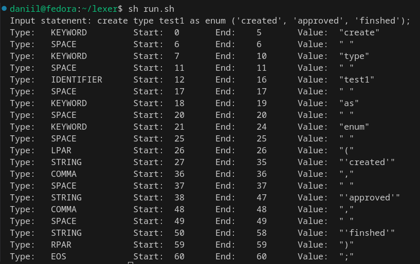
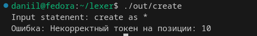
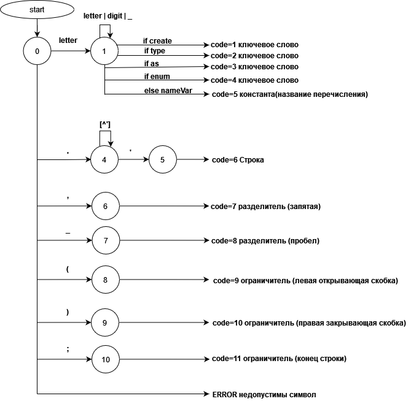

# Лексический анализатор

## Тесты
`create type test1 as enum ('created', 'approved', 'finshed');`



<hr>

`create as *`



## Грамматика
```
<statement> -> <create> <moreSpace> <type> <moreSpace> <identifier> <moreSpace> <as> <moreSpace> <enum> <moreSpace> <args> <eof>

<args> -> <lpar> <moreSpace> <string> {<moreSpace> <comma> <moreSpace> <string>}* <moreSpace> <rpar>

<identifier> -> <letter> {{<digit>}* | {<underLine>}* | {<letter>}*}*

<string> -> <quotes> {{<letter>}* | {<digit>}* | {<underLine>} *}* <quotes> 

<moreSpace> -> <space> {<space>}*

<digit> → “0” | “1” | “2” | “3” | “4” | “5” | “6” | “7” | “8” | “9”
<letter> → “a” | “b” | “c” | ... | “z” | “A” | “B” | “C” | ... | “Z”

<space> -> "[\s\t]"
<underLine> -> "_"
<comma> -> ","
<quotes> "\'"
<lpar> -> "("
<rpar> -> ")"
<eof> -> ";"

<create> -> "create"
<as> -> "as"
<enum> -> "enum"
<type> -> "type"
```

## Диаграмма сканера

