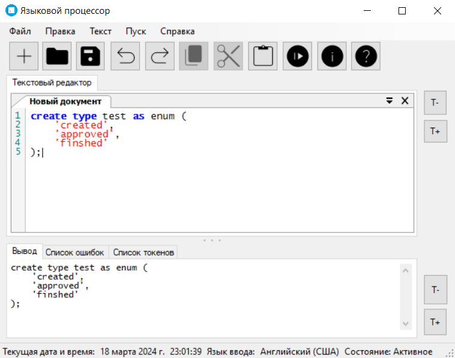

# Лексический анализатор

[Код Синтаксического анализатора](/code/WindowsFormsApp1/Core/Parser)

## Грамматика ANTLR

```
grammar EnumGrammar;
options
{language=CSharp;}

// LEXEMES
DIGIT       : [0-9];
LETTER      : [a-z];

SPACE       : [ \t\r\n]+ -> skip;

UNDER_LINE  : '_';
COMMA       : ',';
EOS         : ';';
QOUTE       : '\'';
LPAR        : '(';
RPAR        : ')';

// RULES
stmt        : ('create' | 'CREATE') create;

create      : ('type' | 'TYPE') type;
type        : LETTER id;

id          : LETTER id
            | ('as' | 'AS') as;

as          : ('enum' | 'ENUM') enum;

enum        : LPAR open;
open        : QOUTE string;
string      : . stringRem;

stringRem   : QOUTE endString
              | . stringRem;

endString   : RPAR close
              | (COMMA open);

close       : EOS;

```

## Граф конечного автомата 


## Тестовые запросы
`create type test as enum ('approved', 'finshed');`


`create sdsd`


