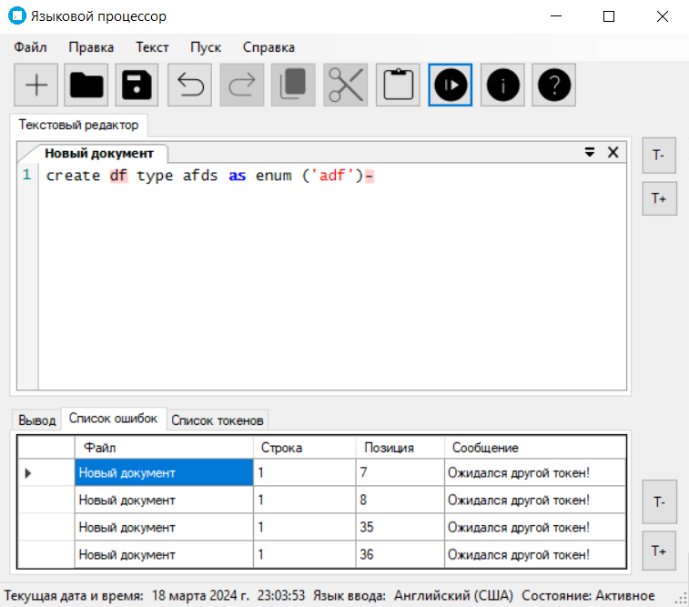

# Лексический анализатор

[Код Синтаксического анализатора](/code/WindowsFormsApp1/Core/Parser)

## Грамматика

```
1) stmt → CREATE create;

2) create → TYPE type;
3) type → LETTER id;

4) id → LETTER id;
5) id → AS as
6) as → ENUM enum;

7) enum → LPAR open;
8) open → QOUTE string;
9) string → LETTER stringRem;

10) stringRem → LETTER stringRem
11) stringRem → QOUTE endString;

12) endString → RPAR close | (COMMA open);

13) close → EOS; 

LETTER → “a” | “b” | “c” | ... | “z” | “A” | “B” | “C” | ... | “Z”
```

## Граф конечного автомата 


------
## Тестовые запросы
**Тестовый запрос:** `create type test as enum ('created', 'approved', 'finshed');`


------
**Тестовый запрос:**
```
create type test as enum
create type test as enum ('created', 'approved', 'finshed');
```


------
**Тестовый запрос:** `create df type afds as enum ('adf')-`




